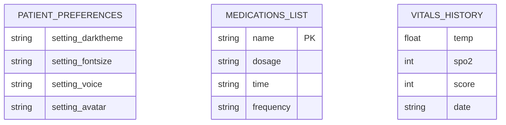
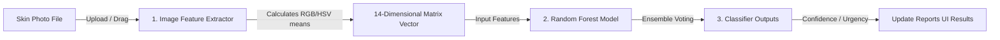

# Software Design Document (SDD)
## Project: MedSev AI - Offline AI-Driven Public Health Platform
**Version**: 1.0  
**Date**: August 18, 2026  

---

### Team Information
| Name | Roll Number | Project Role |
| :--- | :--- | :--- |
| **S. Pallavi** | 241801370052 | Team Lead / AI & Backend Engineer |
| **B. Anusha** | 241801370055 | UI/UX Designer & Frontend Expert |
| **Y. Niharika** | 241801370009 | Voice AI & Interaction Engineer |
| **G. Parwathi** | 241801370061 | Database & Systems Integrator |

---

## 1. System Architecture Overview

MedSev AI uses a client-server structure hosted locally on the user's CPU. The frontend browser coordinates views, voices, and local storage, while the lightweight Flask Python backend processes requests for symptom and skin image predictions.

### System Architecture Diagram
```
+-----------------------------------------------------------------------+
|                             CLIENT BROWSER                            |
|                                                                       |
|   +---------------------------------------------------------------+   |
|   |                  UI (HTML5/CSS3 Style Sheets)                 |   |
|   +---------------------------------------------------------------+   |
|                                   |                                   |
|   +---------------------------------------------------------------+   |
|   |         Controller Logic (static/js/app.js)                   |   |
|   +---------------------------------------------------------------+   |
|               /                       |                       \       |
|       Speech Engines             LocalStorage              Web Audio  |
|      (Recognition/TTS)            (JSON DB)               (SOS Sirens)|
+-----------|---------------------------|-----------------------|-------+
            |                           |                       |
            | POST Requests             | Local Sync            |
            |                           |                       |
+-----------v---------------------------v-----------------------v-------+
|                         LOCAL FLASK SERVER                            |
|                                                                       |
|   +---------------------------------------------------------------+   |
|   |             Routing & API Endpoints (app.py)                  |   |
|   +---------------------------------------------------------------+   |
|                                   |                                   |
|   +---------------------------------------------------------------+   |
|   |            Predictive Engines (model_helper.py)               |   |
|   +---------------------------------------------------------------+   |
|               /                                       \               |
|      Symptom Model pkl                               Skin Model pkl   |
|       (Random Forest)                                 (Random Forest) |
+-----------------------------------------------------------------------+
```

### 1.1 Sequence Diagram: Chatbot Prediction Loop
This sequence diagram shows the message passing and prediction verification cycle when a user enters clinical symptoms:

```mermaid
sequenceDiagram
    autonumber
    actor User as Patient/CHW User
    participant JS as Client Script (app.js)
    participant Flask as Local Flask Host (app.py)
    participant Model as Predictor (model_helper.py)
    database DB as LocalStorage DB

    User->>JS: Types symptoms & clicks Send
    JS->>JS: Parses string for multilingual terms
    JS->>Flask: POST /api/chat {message, lang}
    Flask->>Model: extract_symptoms_from_text(message)
    Model-->>Flask: Returns detected_symptoms array
    Flask->>Model: predict_disease(detected_symptoms)
    Model-->>Flask: Returns predictions, confidences, XAI weights
    Flask-->>JS: JSON payload response
    JS->>User: Appends message bubble & speaks TTS response
    JS->>JS: Redraws Canvas differential chart
    JS->>DB: Stores prediction to Local History
```

---

## 2. Technology Stack

The platform is built using these technologies and libraries:

| Layer | Technology / Library | Version | Description |
| :--- | :--- | :--- | :--- |
| **Backend Host** | Python | 3.10+ | Primary programming language for model inference. |
| | Flask | 2.2.2 | Micro-framework serving local web request loops. |
| **Machine Learning**| Scikit-Learn | 1.1.3 | Trained Random Forest Classifiers and estimators. |
| | Pillow | 9.3.0 | Image loading and feature extraction manipulations. |
| | NumPy | 1.23.5 | Mathematical matrices and feature array math. |
| | Pandas | 1.5.2 | Tabular structures for synthetic datasets. |
| **Frontend Client** | HTML5 | W3C Standard | Document structures and canvas coordinates. |
| | CSS3 | W3C Standard | Sky-blue glassmorphic variables and styling keyframes. |
| | JavaScript | ES6+ | SPA navigations, LocalStorage CRUD, and Speech objects. |
| **Native API** | Web Speech API | Native Browser | Handles SpeechRecognition and SpeechSynthesis. |
| | Web Audio API | Native Browser | Audio Oscillator siren warning triggers. |

---

## 3. Module/Component Design

### 3.1 Backend Modules
1. **`app.py`**:
   * Responsibilities: Initializes the Flask web server locally, serves `index.html`, and exposes endpoints for symptom checking, visual skin scanning, and general chatbot queries.
   * Connects to: `model_helper.py` to trigger classifier predictions.
2. **`model_helper.py`**:
   * Responsibilities: Loads pickle models (`symptom_model.pkl`, `image_model.pkl`) into memory and contains methods to extract symptom tokens, format input matrices, and compute probability weights.
   * Connects to: `models/` binary file system configurations.
3. **`train_models.py`**:
   * Responsibilities: A standalone script to generate synthetic medical symptom logs, perform image color/texture parameter extraction, train Random Forests, and save pickle binaries.

### 3.2 Frontend Modules
1. **`templates/index.html`**:
   * Responsibilities: Holds page frameworks, navigation tabs, section structures, and SVG avatar drawings.
2. **`static/js/app.js`**:
   * Responsibilities: Coordinates SPA tab switching, triggers voice recognitions and text-to-speech outputs, monitors background medication alarms, calculates clinical safety scores, and draws canvas trends.
3. **`static/css/style.css`**:
   * Responsibilities: Houses variables for light/dark themes, accessibility scaling, layout containers, and floating/blinking doctor animations.

---

## 4. Data Design

### 4.1 LocalStorage Database Schemas
The client-side sandboxed database uses these schema structures:



### 4.2 Machine Learning Model Vectors
* **Symptom Vector (24-dim Binary)**: Maps values of $1$ (symptom present) or $0$ (symptom absent) across a pre-defined index of symptoms (e.g. `fever`, `cough`, `fatigue`, `nausea`, etc.).
* **Skin Image Vector (14-dim Continuous)**: Extracts statistical descriptors from raw uploads:
  $$\vec{x} = [\mu_R, \sigma_R, \mu_G, \sigma_G, \mu_B, \sigma_B, \mu_H, \sigma_H, \mu_S, \sigma_S, \mu_V, \sigma_V, \mu_{\text{gradient}}, \sigma_{\text{gradient}}]$$

---

## 5. Interface Design & Data Flow (DFD)

### 5.1 Data Flow Diagram (DFD Level 1): Skin Image Scanner
This DFD outlines the step-by-step processing pipeline for visual diagnostics:



### 5.2 Local REST API Endpoints
* **POST `/api/chat`**:
  * Request Body: `{ "message": "I have high fever", "lang": "en" }`
  * Response Body: `{ "response": "Based on symptoms...", "detected_symptoms": ["fever"], "disease_prediction": {...} }`
* **POST `/api/predict/image`**:
  * Request (Multipart FormData): `image` (binary file), `lang` (string)
  * Response Body: `{ "prediction": "Skin Rash", "confidence": 0.88, "metrics": {...}, "care_guidance": "..." }`
* **POST `/api/predict/symptoms`**:
  * Request Body: `{ "symptoms": ["fever", "cough"], "lang": "en" }`
  * Response Body: `{ "prediction": "Influenza", "confidence": 0.92, "urgency": "High", "probabilities": {...} }`

### 5.3 Single Page Application UI Flow
```
[Sticky Navbar Tabs]
   ├── Home (Quick stats summary, health tips carousel)
   ├── Disease Prediction (Chat messages container, voice controls, XAI panel)
   ├── Medical Reports (Visual scanner drop zone, preview images, results metrics)
   ├── Medicine Reminder (CRUD inputs, active schedules checklist)
   ├── Health Dashboard (Overall health safety ring, log forms, canvas chart trends)
   ├── Emergency (Flashing warning directive card, SOS siren simulators)
   ├── Settings (Light/Dark toggles, voice assistants, font size variables)
   └── About (Algorithmic pipeline details, disclaimer panels)
```

---

## 6. Design Decisions & Justifications

* **Random Forest Ensembles instead of Deep Learning / CNNs**:
  * *Justification*: Deep CNNs or Large Language Models (LLMs) require GPUs and active internet server APIs. Random Forests calculate inference results in under 5 milliseconds on standard client CPUs, enabling complete offline functionality.
* **W3C Native Web Speech instead of Cloud APIs**:
  * *Justification*: Native voice recognition and synthesizers execute locally within the browser, avoiding internet requirements, network latency, and cloud hosting costs.
* **HTML5 LocalStorage instead of SQLite/SQL Server**:
  * *Justification*: LocalStorage requires no server setups, daemon installations, or database configurations, making local client execution zero-maintenance.

---

## 7. Deployment Architecture

* **Local Development Execution**:
  * Executed using **`run.bat`** which sets up a python virtual environment, installs dependencies from `requirements.txt`, runs `train_models.py` to compile pickle models, and starts the Flask server locally.
  * Access URL: served at `http://127.0.0.1:5000/`.

---
**Document Info**  
* **Project**: MedSev AI Public Health Platform  
* **Version**: 1.0  
* **Date**: August 18, 2026  
