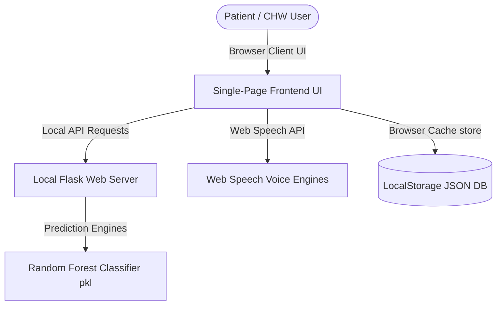

# Software Requirements Specification (SRS)
## Project: MedSev AI - Offline AI-Driven Public Health Platform
**Version**: 1.0  
**Date**: August 18, 2026  

---

### Team Information
| Name | Roll Number | Project Role |
| :--- | :--- | :--- |
| **S. Pallavi** | 241801370052 | Team Lead / AI & Backend Engineer |
| **B. Anusha** | 241801370055 | UI/UX Designer & Frontend Expert |
| **Y. Niharika** | 241801370009 | Voice AI & Interaction Engineer |
| **G. Parwathi** | 241801370061 | Database & Systems Integrator |

---

## 1. Introduction

### 1.1 Purpose
This Software Requirements Specification (SRS) document details the functional and non-functional requirements for the MedSev AI Offline AI-Driven Public Health Platform. It is designed to provide a clear, judge-friendly overview of the system's specifications for the Smart India Hackathon evaluation.

### 1.2 Scope
MedSev AI is a fully offline clinical decision support system. It maps textual symptom descriptions into disease probability classifications and analyzes skin photograph metrics. All calculations and operations are processed on the local CPU without external API calls or database services.

### 1.3 Project Overview
The platform contains:
* An offline multilingual symptom chatbot.
* A visual skin scanner processing RGB, HSV, and texture parameters.
* A native voice interface matching navigations and forms.
* A client-side database scheduling medications and vitals logs.
* An audio oscillator siren triggering warnings during critical physiological entries.

### 1.4 Definitions, Acronyms, and Abbreviations
* **SRS**: Software Requirements Specification
* **SDD**: Software Design Document
* **SPA**: Single Page Application
* **ML**: Machine Learning
* **NLP**: Natural Language Processing
* **TTS**: Text-to-Speech (Voice Assistance)
* **XAI**: Explainable Artificial Intelligence
* **SpO₂**: Peripheral Oxygen Saturation
* **CRUD**: Create, Read, Update, Delete (Medications scheduler)

---

## 2. Overall Description

### 2.1 Product Perspective
MedSev AI runs locally as a standalone web application. It combines a lightweight Flask python backend micro-service with a native HTML5/CSS3/JavaScript frontend client, storing all transactional states inside the client's web browser storage.

#### System Context Model Diagram


### 2.2 System Use Case Model
The following use case model outlines the core interactions between user classes (Patients, Community Health Workers) and the system boundary features:

```mermaid
left-to-right direction
actor User as "Patient / CHW User"

rectangle "MedSev AI Platform System Boundary" {
    usecase UC1 as "Describe Symptoms (Text/Voice)"
    usecase UC2 as "Scan Skin Lesion Photograph"
    usecase UC3 as "Manage Medication Alarm Schedules"
    usecase UC4 as "Log Daily Vitals (Temp / SpO2)"
    usecase UC5 as "Trigger SOS Warning Sirens"
    usecase UC6 as "Toggle Custom Accessibility Settings"
    
    usecase UC1_1 as "Calculate XAI Probability Weights"
    usecase UC2_1 as "Extract Color & Texture Metrics"
}

User --> UC1
User --> UC2
User --> UC3
User --> UC4
User --> UC5
User --> UC6

UC1 ..> UC1_1 : <<include>>
UC2 ..> UC2_1 : <<include>>
```

### 2.3 Product Functions
* **Multilingual Chatbot**: Accepts textual descriptions, extracts symptoms, and predicts underlying conditions.
* **XAI Analytics Sidebar**: Displays bar distributions of differential diagnostics and maps feature weights.
* **Skin Scan Diagnostics**: Processes skin photo uploads and extracts spatial parameters to output conditions.
* **Medication Scheduler**: Inserts pill dosages and checks matching time vectors to synthesize audio alerts.
* **Clinical Health Dashboard**: Calculates health safety indexes and plots temperature trend lines.
* **SOS emergency panel**: Alerts users when SpO₂ drops below 94% and provides directives.

### 2.4 User Classes & Characteristics
* **Patient / General Public**: Demands voice cues, simple tab toggles, large-text scaling, and localized language translation strings.
* **Community Health Worker (CHW)**: Demands high throughput diagnostics, local data exports, and offline system diagnostics.

### 2.5 Operating Environment
* **Server**: Python 3.10+ environment, Flask 2.2+.
* **Client**: Any modern web browser conforming to W3C standards (WAV Audio, SpeechRecognition, LocalStorage).

### 2.6 Design/Implementation Constraints
* Must execute entirely without internet access.
* Database actions must resolve via Web LocalStorage.
* Must not depend on external model hosting APIs (e.g. OpenAI, Cloud Vision).

### 2.7 Assumptions & Dependencies
* **Assumption**: The hosting machine has a working sound card, speaker, and microphone hardware.
* **Dependency**: The web browser must support the native `webkitSpeechRecognition` engine for voice triggers.

---

## 3. Functional Requirements

### 3.1 Multilingual Symptom Checker
* **SRS-FN-01**: The system shall match symptom strings in English, Hindi, Telugu, Tamil, Bengali, Odia, Urdu, Malayalam, and Korean.
* **SRS-FN-02**: The system shall vectorise text into a 24-dimensional binary array representing target symptoms.
* **SRS-FN-03**: The system shall process symptom vectors using a local Random Forest model to calculate disease probabilities.
* **SRS-FN-04**: The system shall display differential diagnostic confidence percentages and XAI feature weights lists.

### 3.2 Visual Skin Scanner
* **SRS-FN-05**: The system shall allow users to upload or drag-and-drop JPEG and PNG skin photos.
* **SRS-FN-06**: The system shall extract 12 color means and standard deviations, plus 2 texture gradient magnitudes.
* **SRS-FN-07**: The system shall display visual predictions and care recommendations directly on the Reports tab.

### 3.3 Medication Scheduler
* **SRS-FN-08**: The system shall allow users to add and delete scheduled medications offline.
* **SRS-FN-09**: The system shall check pill schedule times at 45-second intervals.
* **SRS-FN-10**: The system shall play spoken voice alarms when the system clock matches a medication's time.

### 3.4 Patient Vitals & Health Score
* **SRS-FN-11**: The system shall accept body temperature and oxygen (SpO₂) vitals logs.
* **SRS-FN-12**: The system shall calculate an overall Clinical Safety Score (0-100) based on health limits.
* **SRS-FN-13**: The system shall plot vital safety histories onto an HTML5 Canvas trend graph.

---

## 4. Non-Functional Requirements

### 4.1 Performance
* Prediction latency for both text and skin classifiers shall remain below **10 milliseconds**.
* SPA tab transitions and page updates shall execute in under **100 milliseconds**.

### 4.2 Security & Data Privacy
* **Zero Data Leakage**: No diagnostic data, inputs, or uploaded images shall be transmitted over a network.
* **Storage Isolation**: Vitals and pill logs shall remain strictly isolated inside the browser's LocalStorage sandboxed container.

### 4.3 Reliability & Safety
* **Siren Trigger**: If logged SpO₂ falls below 94% or body temperature rises above 102°F, the system shall sound a continuous audio warning siren.
* **Clinical Disclaimer**: The UI shall display prominent warnings stating that the diagnostic predictions are simulation outputs.

---

## 5. External Interface Requirements

### 5.1 User Interfaces
* A sky-blue, frosted glassmorphism interface.
* Sticky navbar links: Home, Disease Prediction, Medical Reports, Medicine Reminder, Health Dashboard, Emergency, Settings, About.
* A floating MedSev AI assistant Doctor avatar displaying status bubbles.

### 5.2 Software Interfaces
* Local execution: serves on `http://127.0.0.1:5000/`.
* Model weights: processes via binary pickle (`.pkl`) serialized configurations.

---

## 6. System Features Mapping

| Major Feature | Backend Module/File | Frontend Module/File |
| :--- | :--- | :--- |
| **Symptom Chatbot** | `app.py` (lines 106-209)<br>`model_helper.py` | `templates/index.html`<br>`static/js/app.js` |
| **Skin Lesion Scanner** | `app.py` (lines 86-104)<br>`model_helper.py` | `templates/index.html`<br>`static/js/app.js` |
| **Medication CRUD Scheduler** | N/A (Fully Client-side) | `templates/index.html`<br>`static/js/app.js` |
| **Vitals Logger & Charts** | N/A (Fully Client-side) | `templates/index.html`<br>`static/js/app.js` |
| **SOS Siren Oscillators** | N/A (Fully Client-side) | `templates/index.html`<br>`static/js/app.js` |

---
**Document Info**  
* **Project**: MedSev AI Public Health Platform  
* **Version**: 1.0  
* **Date**: August 18, 2026  
